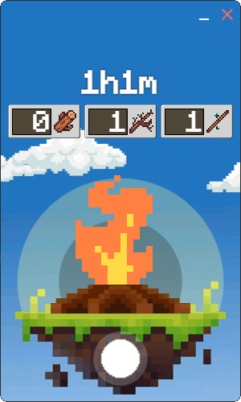

# Hello, I'm Lukylix! 👋

I'm a passionate software engineer with a love for learning and exploring new technologies. Lately, I've been particularly interested in electron apps programming.

## 🛠️ Skills

- Languages: JavaScript, C++,
- Frameworks: React, Node.js, Electron
- Databases: MongoDB, PostgreSQL, MySQL
- Tools: Git, Docker, Jenkins

## 👀 Checkout Ignit

[Igni](https://github.com/Lukylix/Igni) is an Open-source interactive shutdown timer.

## 🙌 Open for Collaboration

I'm open to collaborating on [Igni](https://github.com/Lukylix/Igni) project or any other projects where I can make meaningful contributions. Let's get in touch!

dev.garcia.lucas@gmail.com

## 📊 My GitHub Stats

